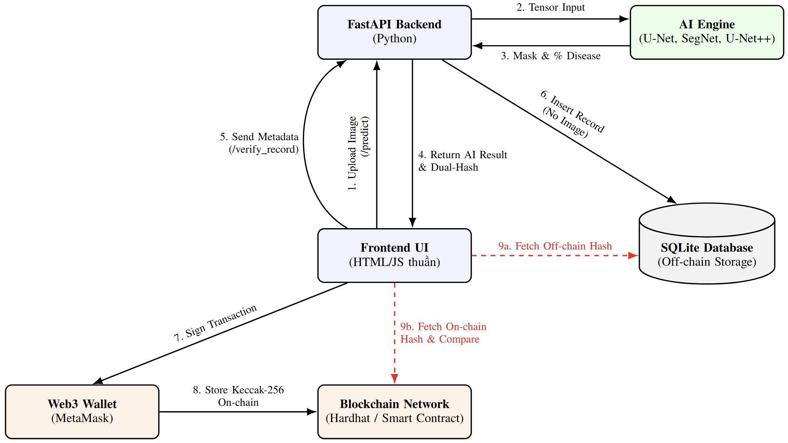
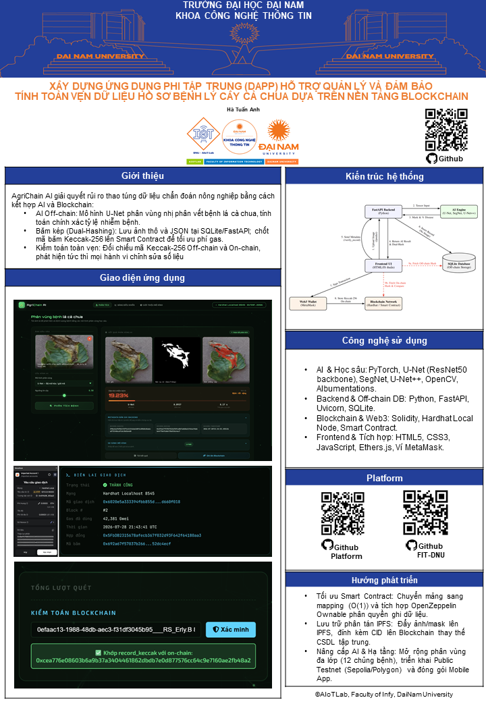
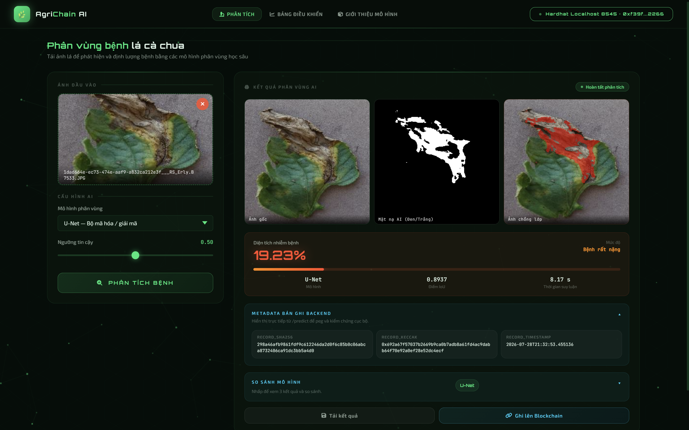
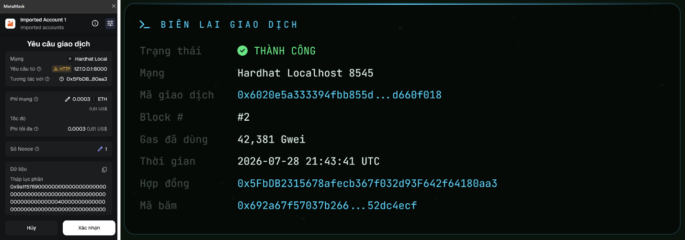
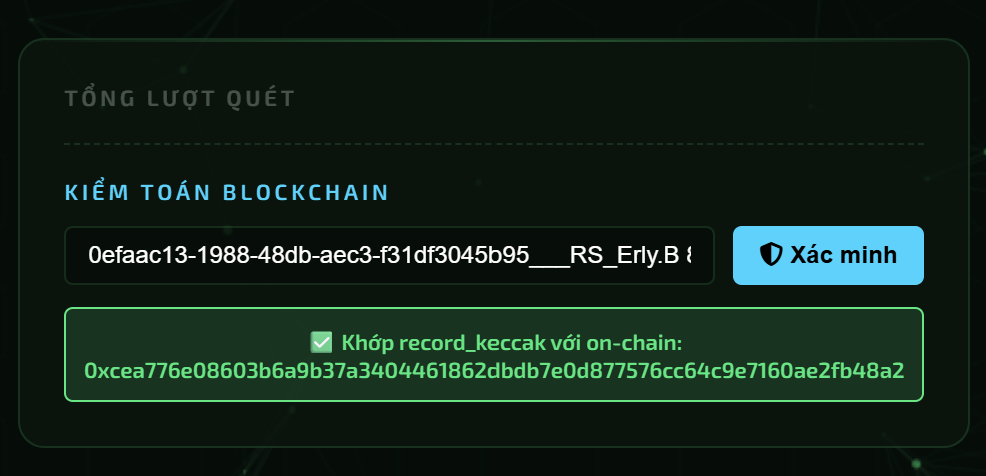
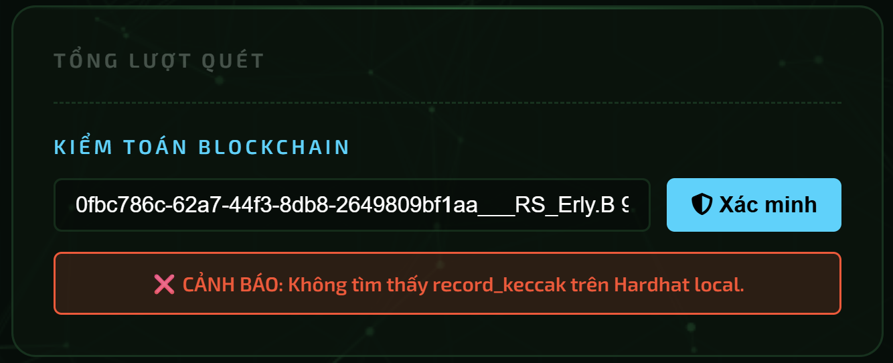
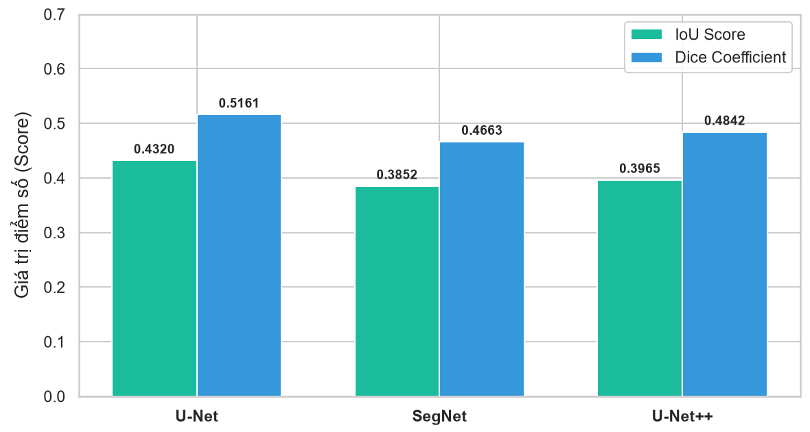

# 🍅 AgriChain AI - Tomato Leaf Disease Segmentation DApp 🚀


[](https://opensource.org/licenses/MIT)
[](https://github.com/tuananh220204/Tomato-Leaf-Segmentation/stargazers)

> **Ứng dụng phi tập trung (DApp) hỗ trợ phân vùng bệnh lá cà chua bằng AI và đảm bảo tính toàn vẹn dữ liệu hồ sơ nông nghiệp trên nền tảng Blockchain**

---

## 📝 1. Giới thiệu (Introduction)

**AgriChain AI** là một hệ thống ứng dụng phi tập trung (DApp) toàn chuỗi (Full-stack Web3) kết hợp giữa công nghệ **Trí tuệ nhân tạo (Deep Learning)** và **Blockchain (Ethereum/EVM)**. Hệ thống giúp tự động chẩn đoán, phân vùng nhị phân (Binary Segmentation) vết bệnh trên lá cà chua và mã hóa chốt vĩnh viễn kết quả chẩn đoán lên sổ cái Blockchain.

### 🎯 Vấn đề cần giải quyết
* **Hạn chế của chẩn đoán thủ công**: Tốn thời gian, phụ thuộc vào kinh nghiệm chủ quan của người trồng và không định lượng được chính xác phần trăm diện tích nhiễm bệnh.
* **Rủi ro thao túng dữ liệu tại CSDL tập trung**: Các hệ thống nông nghiệp số truyền thống lưu dữ liệu trên CSDL nội bộ dễ bị chỉnh sửa trái phép nhằm gian lận bảo hiểm nông nghiệp, thổi phồng chất lượng sản phẩm hoặc làm sai lệch xuất xứ chuỗi cung ứng.

### 🚀 Lợi ích nổi bật
* **🤖 Chẩn đoán AI chính xác**: Sử dụng các kiến trúc mạng nơ-ron tích chập (U-Net, SegNet, U-Net++) chạy trên ảnh 512x512, trả về mặt nạ phân vùng nhị phân và định lượng % diện tích vết bệnh.
* **🔒 Cơ chế Băm kép (Dual-Hashing)**: Tách biệt lưu trữ ảnh nặng Off-chain (SQLite/FastAPI) và chốt mã băm mật mã **Keccak-256** On-chain (Smart Contract Solidity) giúp tối ưu 99% chi phí phí gas.
* **🔍 Kiểm toán toàn vẹn dữ liệu (Data Audit)**: Cho phép đối chiếu tức thì mã băm CSDL ngoại tuyến và mã băm trên chuỗi khối, phát hiện ngay lập tức nếu dữ liệu bị can thiệp trái phép.

---

## 🏗️ 2. Mô tả & Sơ đồ kiến trúc hệ thống (System Architecture)

Hệ thống hoạt động theo mô hình Web3 phân tách hai phân hệ rõ ràng:

1. **Phân hệ Off-chain (AI & Storage)**:
   * **AI Engine**: Khởi chạy trên PyTorch/FastAPI, tiếp nhận ảnh lá cà chua, chạy suy luận qua mô hình U-Net/U-Net++ và trả về % nhiễm bệnh.
   * **Băm song song**: Băm song song siêu dữ liệu JSON chẩn đoán thành mã **SHA-256** (lưu vết trên CSDL SQLite nội bộ) và mã **Keccak-256** (tương thích chuẩn EVM).
2. **Phân hệ On-chain (Blockchain Logging)**:
   * **Smart Contract (`SmartFarm.sol`)**: Lưu trữ mảng cấu trúc `Record` gồm (`recordHash`, `modelName`, `timestamp`).
   * **Web3 Integration**: Sử dụng **Ethers.js** và ví **MetaMask** để ký duyệt giao dịch, đẩy mã băm Keccak-256 lên mạng thử nghiệm Hardhat Local Node.

Sơ đồ dưới đây mô tả chi tiết luồng tương tác giữa người dùng, bộ máy suy luận AI, CSDL SQLite ngoại tuyến và mạng lưới Blockchain:


*Sơ đồ kiến trúc tổng thể hệ thống AgriChain AI*

---

## 🪧 3. Poster đề tài (Project Poster)



📄 **[Tải xuống Poster định dạng PDF chất lượng cao tại đây](images/poster.pdf)**

---

## ✨ 4. Tính năng chính (Features)

* 🧪 **Phân tích chẩn đoán AI**: Tải ảnh kéo thả đơn giản, hiển thị ma trận 3 ảnh (Ảnh thô, Mặt nạ nhị phân, Ảnh phủ vùng bệnh) kèm chỉ số IoU và tỷ lệ % diện tích bệnh.
* 🔄 **Chuyển đổi mô hình linh hoạt (Real-time Model Switching)**: Cho phép chọn xem lại kết quả suy luận của cả 3 mô hình (U-Net, SegNet, U-Net++) ngay trên giao diện Web.
* 🦊 **Tích hợp ví MetaMask**: Kết nối ví Web3 thời gian thực, ký số giao dịch On-chain an toàn.
* 🧾 **Biên lai giao dịch Web3**: Hiển thị TxHash, Block Number, Gas consumed và địa chỉ Smart Contract công khai.
* 🛡️ **Kiểm toán toàn vẹn dữ liệu (Audit View)**: Nhập tên tệp ảnh để đối chiếu mã băm. Hiển thị **Thẻ Xanh ✅** khi dữ liệu an toàn và **Cảnh báo Đỏ ❌** khi phát hiện CSDL nội bộ bị chỉnh sửa/thao túng.

---

## 🖥️ 5. Giao diện ứng dụng DApp

### 🎨 Giao diện Phân tích chẩn đoán AI

*Giao diện phân tích chẩn đoán AI hiển thị ma trận ảnh, chỉ số % bệnh và hai chuỗi mã băm (SHA-256 & Keccak-256)*

### 🦊 Luồng tương tác Web3 & Ký ví MetaMask

*Popup MetaMask yêu cầu ký giao dịch và Thẻ biên lai giao dịch On-chain*

### 🔍 Kiểm toán toàn vẹn dữ liệu
| Trạng thái An toàn (Khớp mã băm) | Trạng thái Cảnh báo (Phát hiện giả mạo) |
| :---: | :---: |
|  |  |
| *Dữ liệu CSDL khớp 100% với Blockchain* | *CSDL bị sửa -> Sai mã băm Keccak-256* |

---

## 📊 6. Biểu đồ đánh giá hiệu năng các mô hình AI

Thực nghiệm trên tập dữ liệu **8.054 ảnh lá cà chua** (chia tỷ lệ Train 70%, Val 15%, Test 15%):



| Mô hình AI | IoU (Test) | Dice Score | Tốc độ hội tụ | Vai trò trong hệ thống |
| :--- | :---: | :---: | :---: | :--- |
| **U-Net (ResNet50)** | **0.4320** | **0.5161** | Vừa phải | **Mô hình chính (Inference Engine)** |
| **U-Net++** | 0.3965 | 0.4842 | Nhanh nhất | Mô hình đối sánh |
| **SegNet** | 0.3852 | 0.4663 | Chậm hơn | Mô hình đối sánh |

---

## 💻 7. Yêu cầu hệ thống (System Requirements)

### 🖥️ Yêu cầu phần cứng
* **CPU**: Intel Core i5 / AMD Ryzen 5 trở lên.
* **RAM**: Tối thiểu 8GB (khuyến nghị 16GB).
* **GPU**: NVIDIA GPU có hỗ trợ CUDA (Tùy chọn, giúp chạy suy luận AI nhanh hơn).

### 💾 Yêu cầu phần mềm
* **Hệ điều hành**: Windows 10/11, macOS, hoặc Linux.
* **Môi trường**: Python 3.10+, Node.js (v18+).
* **Trình duyệt**: Google Edge / Chrome / Firefox có cài đặt tiện ích mở rộng **MetaMask**.

---

## ⚙️ 8. Hướng dẫn cài đặt & Khởi động (Installation & Setup)

### 🚀 Cách 1: Khởi động tự động bằng 1-Click (Khuyên dùng trên Windows)
Dự án được tích hợp sẵn file script `run_app.bat` tự động khởi chạy Hardhat Node, Deploy Smart Contract, chạy FastAPI Backend và mở Frontend:

```bash
# Nhấp đúp chuột vào file run_app.bat tại thư mục gốc dự án
run_app.bat
```

### 🛠️ Cách 2: Khởi động thủ công từng phân hệ

**Bước 1: Clone Repository & Tạo môi trường ảo Python**
```bash
git clone [https://github.com/tuananh220204/Tomato-Leaf-Segmentation.git](https://github.com/tuananh220204/Tomato-Leaf-Segmentation.git)
cd "Tomato Leaf Segmentation"

# Tạo và kích hoạt virtual environment
python -m venv .venv

# Trên Windows:
.venv\Scripts\activate

# Trên macOS/Linux:
source .venv/bin/activate

# Cài đặt thư viện Python
pip install -r requirements.txt
```

**Bước 2: Cài đặt Dependencies Web3**
```bash
cd webapp
npm install
```

**Bước 3: Khởi động mạng Blockchain Hardhat Local**
```bash
cd webapp
npm run node
```

**Bước 4: Deploy Smart Contract SmartFarm.sol**
```bash
cd webapp
npm run deploy:localhost
```

**Bước 5: Khởi động AI Backend (FastAPI)**
```bash
cd webapp/backend
python -m uvicorn main:app --host 127.0.0.1 --port 8000
```

**Bước 6: Truy cập DApp Frontend**
Mở file `webapp/frontend/index.html` trực tiếp trên trình duyệt Web (Edge/Chrome).

> 💡 **Bước 7: Lưu ý cấu hình ví MetaMask (Quan trọng)**
> Để thực hiện giao dịch On-chain, vui lòng cài đặt mạng Hardhat Localhost trên ví MetaMask với các thông số:
> * **Network Name**: Hardhat Localhost
> * **RPC URL**: `http://127.0.0.1:8545`
> * **Chain ID**: `31337` (hoặc `1337`)
> * **Currency Symbol**: ETH
> 
> Sau đó, import một trong các tài khoản (Private Key) được Hardhat Node tự động sinh ra (ở Terminal 1 tại Bước 3) vào MetaMask để có sẵn 1000 ETH testnet làm phí Gas.

---

## 📂 9. Cấu trúc thư mục (Project Structure)

```text
Tomato Leaf Segmentation/
├── .gitignore                  # Bỏ qua các file/thư mục không cần đẩy lên Git
├── LICENSE                     # Giấy phép MIT
├── README.md                   # Hướng dẫn dự án
├── requirements.txt            # Danh sách thư viện Python cần cài
├── run_app.bat                 # File chạy hệ thống nhanh trên Windows
├── package-lock.json           # Lockfile npm cho thư mục gốc
│
├── data/                       # Dữ liệu huấn luyện và đánh giá
│   ├── processed/              # Dữ liệu đã được xử lý và chia train/val/test
│   │   ├── train/
│   │   ├── val/
│   │   └── test/
│   └── raw/                    # Dữ liệu gốc từ các lớp bệnh lá cà chua
│
├── docs/                       # Tài liệu và hình ảnh minh họa
│   └── visualizations/         # Các biểu đồ, ảnh kết quả và đồ thị đánh giá
│
├── images/                     # Ảnh minh họa hoặc ảnh dùng cho demo
│
├── models/                     # Thư mục lưu mô hình
│   └── saved/                  # Checkpoint các mô hình tốt nhất
│
├── notebooks/                  # Notebook thử nghiệm và huấn luyện
│   ├── colab_training.ipynb
│   ├── Segnet.ipynb
│   ├── Unet.ipynb
│   └── Unetpp.ipynb
│
├── scripts/                    # Script tiền xử lý và huấn luyện
│   ├── generate_report.py
│   ├── prepare_data.py
│   ├── split_data.py
│   ├── train_segnet.py
│   ├── train_unet.py
│   └── train_unetplusplus.py
│
├── src/                        # Mã nguồn chính của dự án
│   ├── __init__.py
│   ├── config.py               # Cấu hình đường dẫn và tham số
│   ├── data/                   # Dataset, transforms, preprocessing
│   ├── eval/                   # Đánh giá mô hình và visualize
│   ├── models/                 # Các kiến trúc U-Net, SegNet, U-Net++
│   └── utils/                  # Metrics, losses, helpers
│
└── webapp/                     # Ứng dụng blockchain + backend AI
    ├── backend/                # Backend xử lý inference
    ├── contracts/              # Smart contract Hardhat
    ├── frontend/               # Giao diện web
    ├── hardhat/                # Cấu hình và scripts triển khai Hardhat
    ├── hardhat.config.js
    ├── package.json
    └── package-lock.json
```

---

## 🛠️ 10. Công nghệ sử dụng (Technologies Used)
* **Trí tuệ nhân tạo (AI Engine):** Python 3.10, PyTorch, segmentation-models-pytorch (smp), OpenCV, Albumentations.
* **Backend & CSDL Off-chain:** FastAPI, Uvicorn, SQLAlchemy, SQLite3.
* **Blockchain & Smart Contract:** Solidity (v0.8.24), Hardhat, EVM Local Node.
* **Frontend & Tích hợp Web3:** HTML5, CSS3 (Dark mode UI), JavaScript (ES6+), Ethers.js (v5.7.2), Ví MetaMask.

---

## 👨‍💻 11. Tác giả & Giảng viên hướng dẫn (Author)
* **Giảng viên hướng dẫn:** TS. Trần Đăng Công
* **Sinh viên thực hiện:** Hà Tuấn Anh
* **Lớp:** CNTT 16 - 06, Khoa Công nghệ Thông tin - Trường Đại học Đại Nam
* **GitHub:** [@tuananh220204](https://github.com/tuananh220204)
* **Email:** tuananh22022004@gmail.com

---

## 🤝 12. Đóng góp & Giấy phép (Contributing & License)
* Dự án phát triển phục vụ mục đích nghiên cứu học thuật. Rất hoan nghênh mọi đóng góp, báo lỗi (issues) hoặc yêu cầu kéo (pull requests) từ cộng đồng.
* Dự án được cấp phép theo **Giấy phép MIT** - tự do học tập, sao chép và phát triển mã nguồn mở.

---

## 🙏 13. Cảm ơn (Acknowledgments)
* Em xin chân thành cảm ơn thầy **TS. Trần Đăng Công** đã tận tình hướng dẫn và định hướng kiến thức kỹ thuật quý báu trong suốt quá trình triển khai đồ án này.
* Cảm ơn Khoa CNTT - Trường Đại học Đại Nam cùng cộng đồng mã nguồn mở PyTorch, FastAPI & Hardhat đã cung cấp nền tảng công nghệ tuyệt vời.
